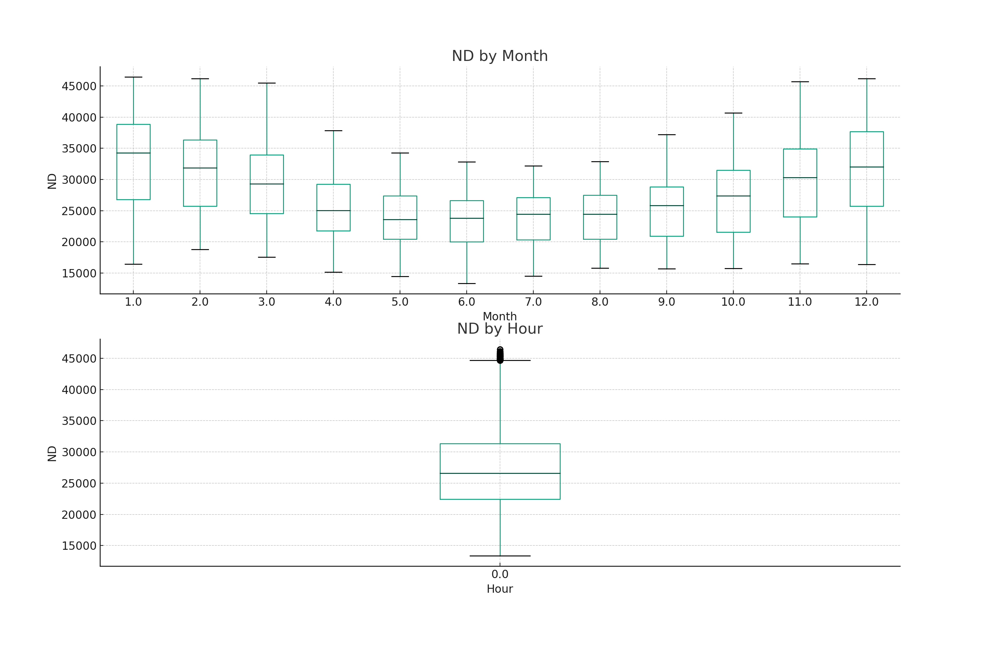

# Energy Demand Forecasting Project

This project involves training a machine learning model to forecast energy demand.

The data used in this project consists of hourly energy demand data for the years 2020 to 2023. The data includes the following features:

- `SETTLEMENT_DATE`: The date and time of the data point.
- `SETTLEMENT_PERIOD`: A number from 1 to 48 representing the half-hour period of the day. For example, 1 represents the period from 00:00 to 00:30, 2 represents the period from 00:30 to 01:00, and so on.
- `ND`: The non-delivery amount of energy in MWh.

The model was trained to predict the `ND` value based on the time-based features derived from `SETTLEMENT_DATE`.

The plot above shows the ND values over time.

The box plots above show the distribution of the ND values by month and hour.

The project includes the following files:

- `project_script.py`: A Python script that preprocesses the data, creates time-based features, trains the model, and evaluates its performance.
- `xgboost_model.pkl`: The trained XGBoost model.
- `README.md`: A README file that explains the project and its components.

The bar plot above shows the importance of each feature used in the model.

To run the project, execute the `project_script.py` script. This will output the root mean square error (RMSE) of the model on the test set.

The plot above shows the true and predicted ND values on the test set.
