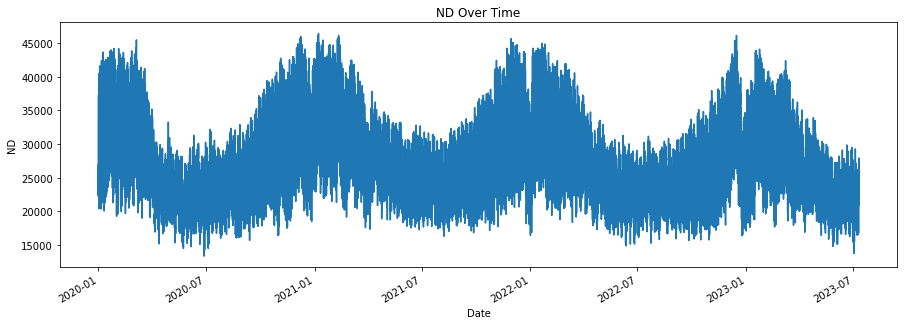
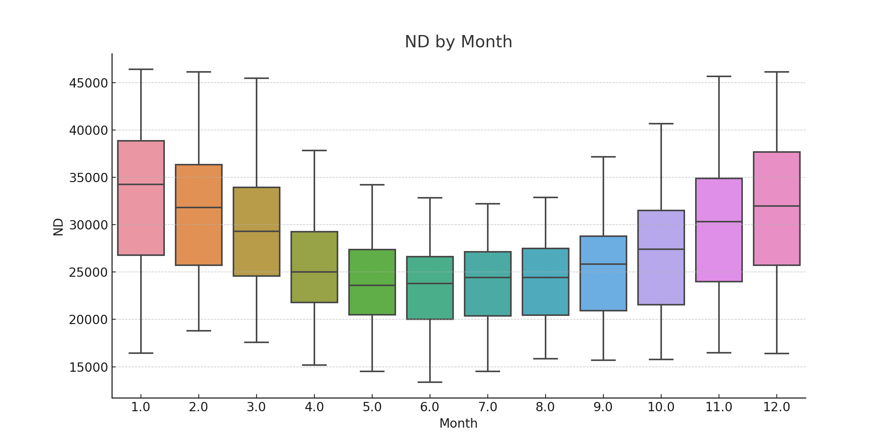
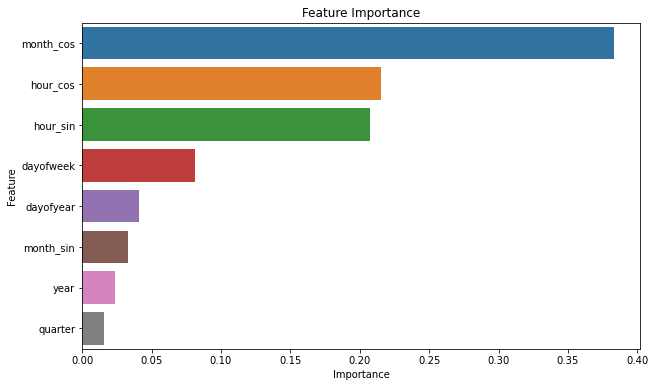
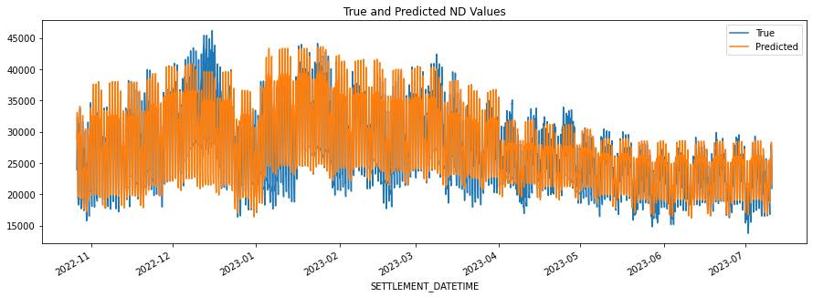

# Energy Demand Forecasting Project

This project involves training a machine learning model to forecast energy demand.

The data used in this project consists of hourly energy demand data for the years 2020 to 2023 from the UK, from [here](https://data.nationalgrideso.com/demand/historic-demand-data). The data includes the following features:

- `SETTLEMENT_DATE`: The date and time of the data point. All times are UK time and for the half hour beginning.
- `SETTLEMENT_PERIOD`: A number representing the half-hour period of the day. For example, 1 represents the period from 00:00 to 00:30, 2 represents the period from 00:30 to 01:00, and so on.
- `ND`: The non-delivery amount of energy in MWh. All values are an average over the half hour.

The model was trained to predict the `ND` value based on the time-based features derived from `SETTLEMENT_DATE`.

The plot above shows the ND values over time.

The box plot above shows the distribution of the ND values by month.

The project includes the following files:

- `project_script.py`: A Python script that preprocesses the data, creates time-based features, trains the model, and evaluates its performance.
- `xgboost_model.pkl`: The trained XGBoost model.
- `README.md`: A README file that explains the project and its components.

The bar plot above shows the importance of each feature used in the model.

To run the project, execute the `project_script.py` script. This will output the root mean square error (RMSE) of the model on the test set.

The plot above shows the true and predicted ND values on the test set.

## Future Improvements
While our current model uses time-based features derived from the SETTLEMENT_DATE, there are several other features that could be used to improve the model's performance in forecasting energy demand:

1. Weather Data: Weather conditions, especially temperature and humidity, can significantly influence energy demand. For example, higher temperatures can increase demand due to the use of air conditioning systems, while lower temperatures can lead to increased heating use. Therefore, incorporating weather data into the model could potentially improve its predictive accuracy.

2.  Holiday Indicators: Energy usage patterns can vary on public holidays, weekends, and during specific festive seasons. A binary feature indicating whether a day is a holiday or not could help the model capture these variations.

3. Historical Demand Data: The energy demand in the past hours or days can be indicative of future demand. Incorporating lagged features, i.e., demand values at previous time steps, might improve the model's ability to capture temporal dependencies in the data.

Please note that the addition of these features would require access to the relevant data and might involve substantial preprocessing. Moreover, while these features could potentially improve the model's performance, the actual impact would need to be validated through experimentation.
